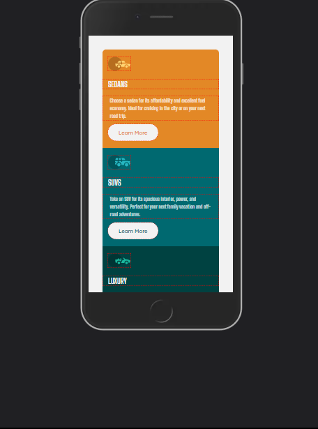
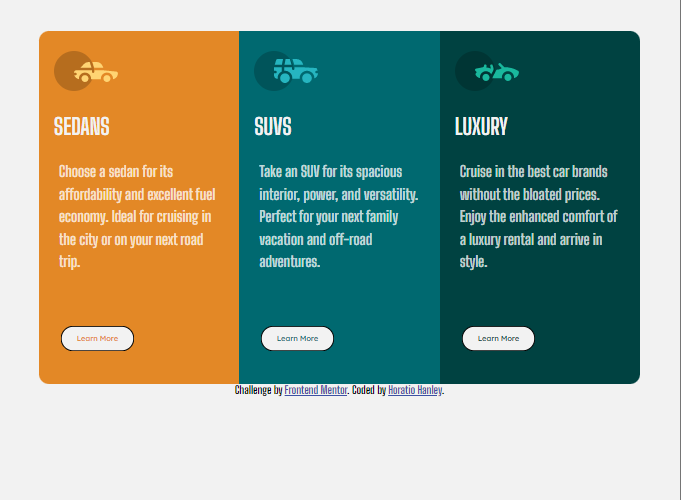

# Frontend Mentor - 3-column preview card component solution

This is a solution to the [3-column preview card component challenge on Frontend Mentor](https://www.frontendmentor.io/challenges/3column-preview-card-component-pH92eAR2-). Frontend Mentor challenges help you improve your coding skills by building realistic projects. 

## Table of contents

- [Overview](#overview)
  - [The challenge](#the-challenge)
  - [Screenshot](#screenshot)
  - [Links](#links)
- [My process](#my-process)
  - [Built with](#built-with)
  - [What I learned](#what-i-learned)
  - [Continued development](#continued-development)
  - [Useful resources](#useful-resources)
- [Author](#author)
- [Acknowledgments](#acknowledgments)

**Note: Delete this note and update the table of contents based on what sections you keep.**

## Overview

### The challenge

Users should be able to:

- View the optimal layout depending on their device's screen size
- See hover states for interactive elements

### Screenshot

### Links

- Solution URL: [Add solution URL here](https://your-solution-url.com)
- Live Site URL: [Add live site URL here](https://your-live-site-url.com)

## My process
  1. Created HTML layout. 
  2. Styled using css
  3. Mobile First
  4. Desktop Design

### Built with

- Semantic HTML5 markup
- Flexbox
- CSS Grid
- Mobile-first workflow

**Note: These are just examples. Delete this note and replace the list above with your own choices**

### What I learned

- N/A

### Continued development

- N/A

### Useful resources

- N/A

## Author

- Website - [Horatio Hanley](https://ray-xavier-2021.github.io/3-column-preview-card-component-main/)
- Frontend Mentor - [@Ray-Xavier-2021](https://www.frontendmentor.io/profile/Ray-Xavier-2021)
- GitHub - [@Ray-Xavier-2021](https://github.com/Ray-Xavier-2021)

## Acknowledgments

- N/A
